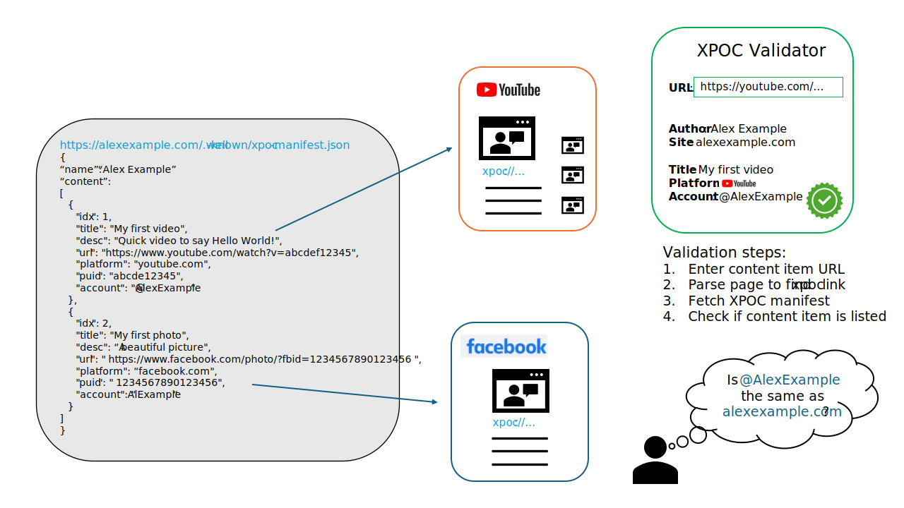

# Cross-Platform Origin of Content (XPOC) Framework

This project introduces the proof-of-concept Cross-Platform Origin of Content (XPOC) framework, along with a prototype implementation.

The aim of the XPOC framework is to help verifying the authenticity of content shared across various web platforms such as YouTube, Twitter, Facebook, etc. A content owner creates a XPOC manifest that contains references to the content items they created across various platforms, and hosts it on its well-known website. The owner then adds a XPOC URI referencing its own manifest to the content items. Verifiers can validate the origin of a content item with a XPOC URI by dereferencing it to retrieve the owner's manifest, and by verifying that the content item is listed within it. For details, see the framework's [specification](./doc//xpoc-specification.md).

The repository contains the Express [server](./server.ts) and the main XPOC logic [file](./xpoc.ts).

## System Overview

The XPOC system fetches data from various platforms and creates a manifest for each content piece. The manifest includes data like the title of the content, the platform, the unique identifier (PUID) of the content, and the account that published the content. 

The XPOC lifecycle is as follows:

- The user sends a POST request to the /process endpoint with the URL of the content to be verified.
- The server analyzes the URL to determine the platform (for now either Youtube or Twitter). Using the specific platform's data fetcher, it extracts necessary data for verification.
- A POST request to /add endpoint is made to add new XPOC verifications, providing the URL and platform in the request body.
- A new manifest is created containing the verification details.



## Deployment example

This section describes an example of how a user could use the system to verify the original content of a Youtube video or a Twitter post.

### Server setup
The server can be started by running `npm run start`, which starts the express server listening on port 3000.

### Processing a request

To process a request, the user needs to make a POST request to `/process` endpoint. The body of the request should be a JSON object containing the url field, which is the URL of the content to be verified.

## Setup and Usage

1. **Environment Variables**: Create a `.env` file in the root directory of your project. Add the environment-specific variables on new lines in the form `NAME=VALUE`. For example, `TWITTER_BEARER_TOKEN=YOUR_BEARER_TOKEN`. Read more at the end regarding platform specific explorations [here](./PLATFORM.md). 

2. **Running the Server**: You can run the server by executing `node server.ts` in the root directory of the project.

3. **Adding a New Content Piece**: You can add a new content piece by sending a POST request to the `/add` endpoint of the server with the following JSON body:
    ```json
    {
        "url": "URL_OF_THE_CONTENT",
        "platform": "PLATFORM_OF_THE_CONTENT"
    }
    ```
    This will return a new XPOC manifest including the new content piece.

4. **Processing a Content Piece**: You can process a content piece by sending a POST request to the `/process` endpoint of the server with the following JSON body:
    ```json
    {
        "url": "URL_OF_THE_CONTENT"
    }
    ```
    This will return the XPOC manifest of the content piece if it exists, along with the matching content piece from the manifest.

### HTML File Usage
This project includes two HTML files that serve specific purposes:

- fetch.html
- generate.html

### fetch.html
fetch.html is the interface for the Cross-Platform Origin of Content (XPOC) validator. It allows users to enter the URL of the content they want to verify. The page will send a POST request to the server, process the URL, and display the related manifest information along with the corresponding media information, if available.

To use this page, enter a URL into the input field and click the "Verify" button. The related information, if found, will be displayed on the same page.

### generate.html
generate.html provides a form that allows users to generate a new XPOC manifest. Users can input multiple URLs (each on a new line) and select the platform (YouTube or Twitter, for example) from which the content originates.

On submission, the form sends a POST request to the server for each URL. The server processes these requests and adds the new content pieces to the XPOC manifest. The output of this operation is displayed on the same page.

To use this page, enter your URLs into the textarea, select a platform from the dropdown menu, and click the "Generate Manifest" button. The updated manifest will be displayed on the page.

## Contributing

This project welcomes contributions and suggestions.  Most contributions require you to agree to a
Contributor License Agreement (CLA) declaring that you have the right to, and actually do, grant us
the rights to use your contribution. For details, visit https://cla.opensource.microsoft.com.

When you submit a pull request, a CLA bot will automatically determine whether you need to provide
a CLA and decorate the PR appropriately (e.g., status check, comment). Simply follow the instructions
provided by the bot. You will only need to do this once across all repos using our CLA.

This project has adopted the [Microsoft Open Source Code of Conduct](https://opensource.microsoft.com/codeofconduct/).
For more information see the [Code of Conduct FAQ](https://opensource.microsoft.com/codeofconduct/faq/) or
contact [opencode@microsoft.com](mailto:opencode@microsoft.com) with any additional questions or comments.

## Trademarks

This project may contain trademarks or logos for projects, products, or services. Authorized use of Microsoft 
trademarks or logos is subject to and must follow 
[Microsoft's Trademark & Brand Guidelines](https://www.microsoft.com/en-us/legal/intellectualproperty/trademarks/usage/general).
Use of Microsoft trademarks or logos in modified versions of this project must not cause confusion or imply Microsoft sponsorship.
Any use of third-party trademarks or logos are subject to those third-party's policies.
